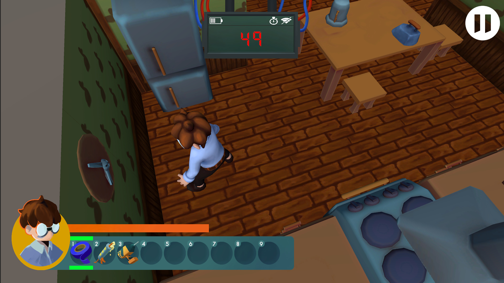
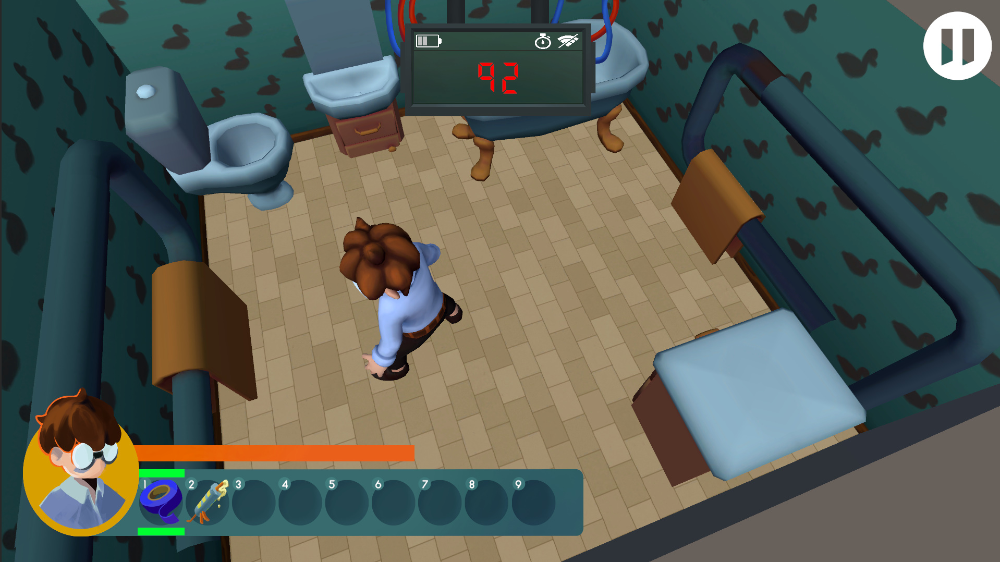
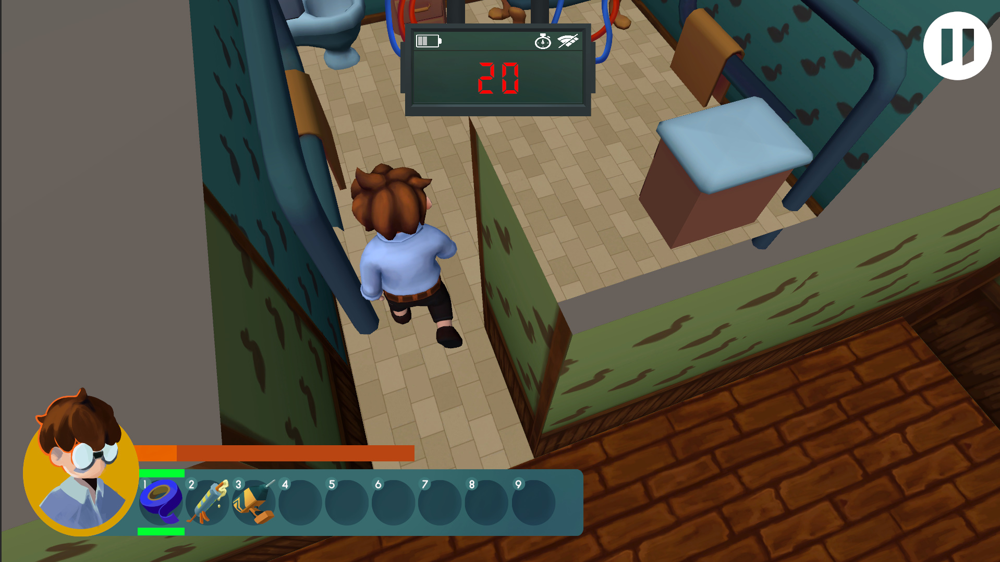

# CheckItTwice
Небольшая история про обыкновенного офисного клерка, который любит вечеринки.

Симулятор в котором главные герой очень спешит на работу.
Он просыпается и пытается собраться. Однако у него дома полный кавардак. Утюг работает, окно не закрыто, сигнализация без батареек. 
Но он думает, что ничего плохого не случиться. Однако закон Мёрфи работает, и оставленный утюг, превращает квартиру в пепел, 
а выключенная сигнализация без проблем позволяет грабителям вынести всё имущество. 

Помоги нашему герою починить и выключить всё, что может привести к уничтожению квартиры. 
Для этого подбирай разбросанные по всей квартире инструменты и чини всё, что ими чиниться, пусть удача будет с тобой!

Управление:
  WASD - передвижение  
  SHIFT - бег
  ЛКМ - выбор предметов 
  1-9 или СКМ - выбор предметов из инвентаря
  ЛКМ - использование предметов

Предметы в игре можно включить / выключить, для этого нажмите ЛКМ в зоне действия 
Также предметы в игре можно ремонтировать, выбрав соответствующий предмет из инвентаря и щелкнув ЛКМ в области действия. 

Ига содержит обучение и несколько уровней. Имеет систему подсказок для более быстрой адаптации игроков к геймплею.

